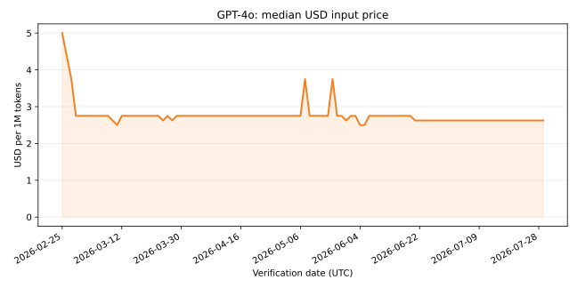

# AI Price History

[English](README.md)

[AICostIndex](https://aicostindex.com) が公開する、AI モデル価格履歴の
日次更新・機械可読データセットです。USD と JPY の両方を、確認日つきで収録します。

[](https://creativecommons.org/licenses/by/4.0/)



## データ

全データは [`data/ai-prices.csv`](data/ai-prices.csv) にあります。1 行が
1 件の確認済み価格観測です。USD と JPY はいずれも 100 万トークンあたりの価格で、
JPY は確認時点で AICostIndex が採用した日本の消費税 10% の扱いを含みます。

このリポジトリに含まれるのは公開データだけです。生の取得記録、内部証跡、
データベース識別子、運用メタデータ、購読者情報、認証情報は公開しません。

### CSV スキーマ

ヘッダーは次の 6 列で固定です。

```csv
model,date,field,usd,jpy,source
```

| 列 | 型 | 内容 |
|---|---|---|
| `model` | string | 正規化されたモデル表示名 |
| `date` | `YYYY-MM-DD` | UTC の確認日 |
| `field` | enum | `input`、`output`、`cached_input` のいずれか |
| `usd` | 0 以上の数値 | 100 万トークンあたりの USD 価格 |
| `jpy` | 0 以上の数値 | 100 万トークンあたりの JPY 価格（AICostIndex の税処理を含む） |
| `source` | 公開 HTTP(S) URL | 観測に使用した公開証跡または出典 URL |

機械可読の契約は [`schema.json`](schema.json) にあります。

初回公開には、この 6 列の公開スキーマで AICostIndex が提供できる、重複を除いた
全履歴観測を収録しています。複数の内部レコードが同一の
`model,date,field,usd,jpy,source` に一致する場合、公開スキーマには内部 ID を
含めないため、CSV では 1 行にまとめます。

出典の優先順位は次のとおりです。

1. 確認証跡とともに保存された公開 URL
2. 確認済みの公式・チャネル価格に対応するベンダー公式価格ページ
3. 旧 Line A 観測に対応する公開 LiteLLM ソーススナップショット
4. 外部証跡 URL の保存開始前のレコードに対応する AICostIndex のモデル／データページ

現在のモデル表、出典注記、方法論は
[AICostIndex](https://aicostindex.com) と
[データソースページ](https://aicostindex.com/ja/data-source)を参照してください。

## 引用

このデータセットは
[Creative Commons Attribution 4.0 International](https://creativecommons.org/licenses/by/4.0/)
で提供しています。利用時は確認日を添えてください。

> **出典：AICostIndex（YYYY-MM-DD 確認）**

短い表記では「出典：AICostIndex（確認日つき）」とし、次の URL へリンクしてください。

```text
出典：AICostIndex（YYYY-MM-DD 確認）
https://github.com/koyamasann/ai-price-history
CC BY 4.0
```

## グラフ例

同じ日付に複数の公開出典がある場合に 1 社を恣意的に優先しないよう、同梱例では
モデルと日付ごとの USD 入力価格の中央値を計算します。

```bash
python -m pip install matplotlib
python examples/plot.py "GPT-4o" input
```

同等の分析コード：

```python
import csv
from collections import defaultdict
from statistics import median

series = defaultdict(list)
with open("data/ai-prices.csv", newline="", encoding="utf-8") as source:
    for row in csv.DictReader(source):
        if row["model"] == "GPT-4o" and row["field"] == "input":
            series[row["date"]].append(float(row["usd"]))

daily_median = [(day, median(values)) for day, values in sorted(series.items())]
```

## 更新と検証

非公開の `aicost-agent` パイプラインが、確認済みの新しい公開観測を 1 日 1 回
追記します。リポジトリ間の書き込みには、このリポジトリだけを対象に
**Contents: Read and write** を許可した専用の fine-grained GitHub token を使います。

各 push で次を検証します。

- 6 列スキーマとの完全一致
- 数値型と日付型
- 公開出典 URL
- 重複行
- 状態ファイルと行数の整合
- 一般的な認証情報・秘密鍵シグネチャ

日次ジョブは既存行を書き換えません。訂正は、明示的にレビューしたデータ commit
として行います。

英文の [`README.md`](README.md) を真源とし、この日本語版は実質的な内容変更が
ある場合に同期します。

## 免責事項

このデータセットは AICostIndex が独自に収集・維持しています。価格はベンダーの
公式価格ページから収集し、表示された日付に確認していますが、誤りや欠落が含まれる
可能性があります。データは現状有姿で提供され、いかなる保証もありません。判断に
利用する前に、必ずベンダーの公式ページで最新価格を確認してください。

CC BY 4.0 の条件で自由に利用できます。リンクつきの出典表記を歓迎します。

## ライセンス

CC BY 4.0 の全文は [`LICENSE`](LICENSE) を参照してください。
